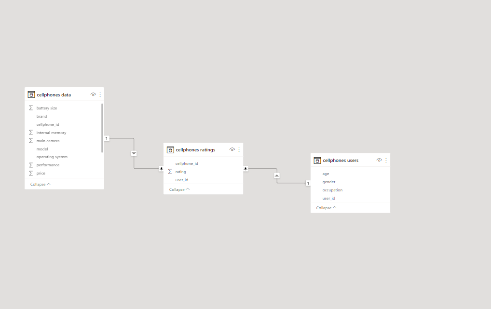
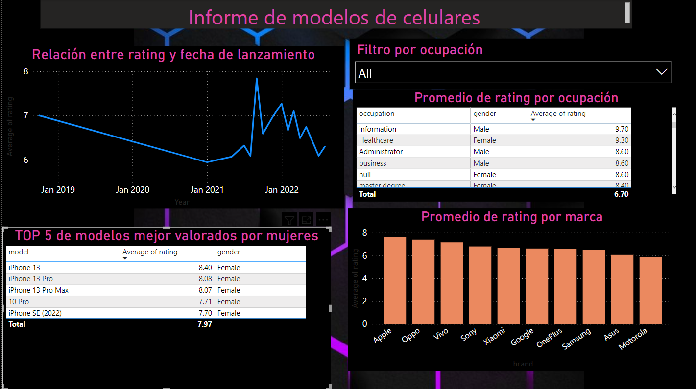
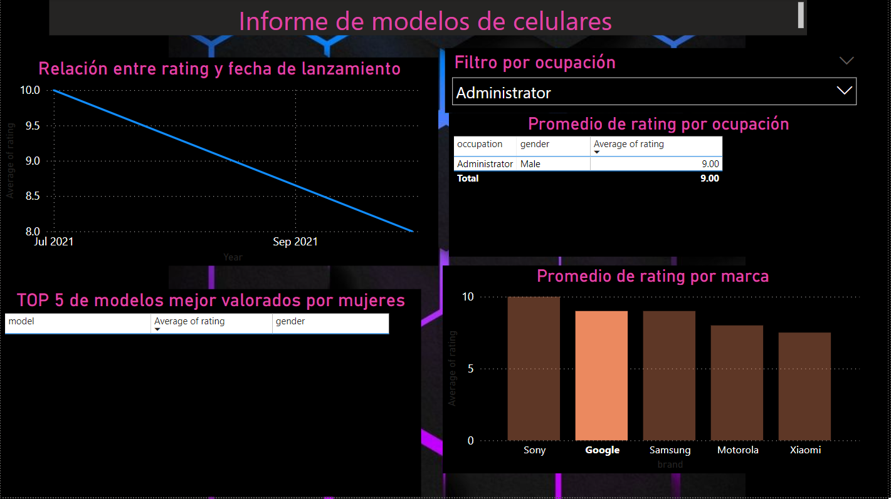
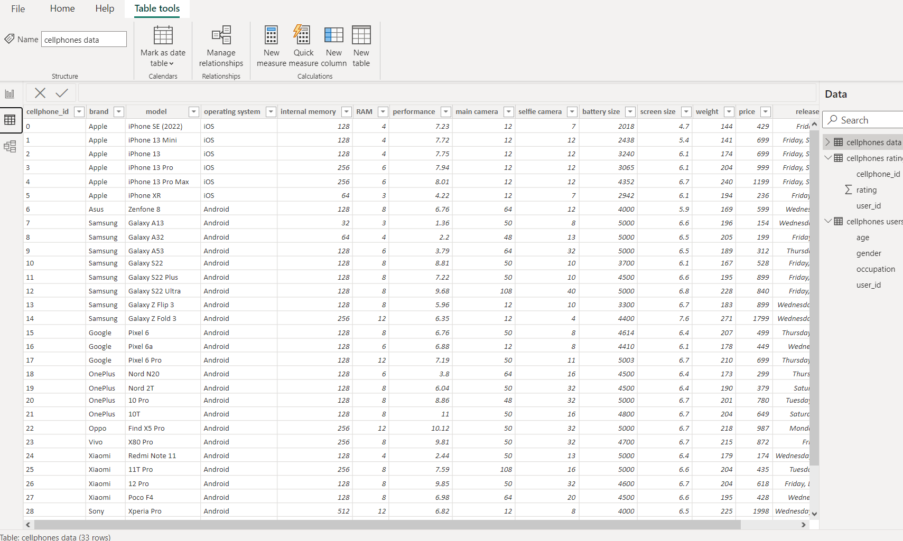

#### Cellphones dashboard

In this project I made a simple dashboard for a small database about cellphones.

#### Database Schema

This database consisted of 3 tables called cellphones data, cellphones rating and cellphones users.
This database only had two connections.

#### Dashboard

The dashboard was created following the criteria:

<ol>
  <li>-Relationship between average rating and release date.</li>
  <li>-Top 5 best cellphone models rated by women</li>
  <li>-Prices per brand</li>
  <li>-Relationship between ocupation and cellphone model</li>
  <li>-Average rating per gender per ocupation</li>
</ol>

<ol>
<li>Date are better explained using lines.</li>
<li>Top 5 should be presented as a table.</li>
<li>I selected prices per brand as a column graphic, but it could be a table. </li>
<li>I created a filter to explore the rest of graphics acording to occupation.</li>
<li>I created a table to display average rating per gender. </li>

</ol>  

